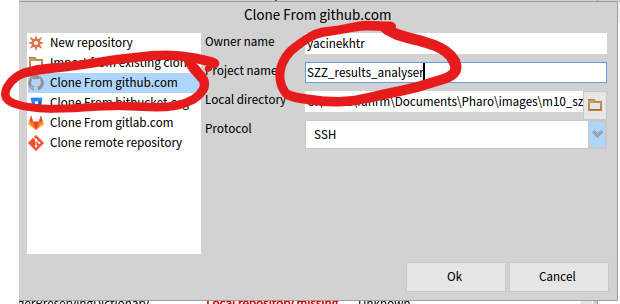
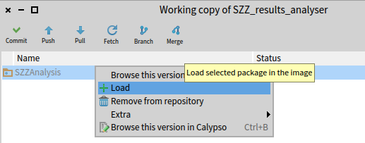

# SZZUnleashed using GitHub repositories and issues

Build the docker image that works with GitHub:

``` bash
docker build -t szz_github -f Dockerfile_github .
```

Then you can run the sample automation script `pipeline.py` that expects a list of projects in `entree/Projects.csv`. This example will calculate the correlation of the detected bugs with the size of the files where they're located. It uses a Pharo image in part of the steps, so you must install Pharo (see below). You must have a variable GITHUB_TOKEN defined in your environment, because it accesses the GitHub API. Get a token following [these instructions](https://docs.github.com/en/authentication/keeping-your-account-and-data-secure/managing-your-personal-access-tokens).

The docker image is run from `pipeline.py`, which is the main driver of the analysis.

### If you don't want to run the automation

You don't have to use the the pipeline automation. It's possible to run the docker image alone, but you have to take care of the paths:

``` bash
docker run -e GITHUB_TOKEN=$env:GITHUB_TOKEN -v h:/SZZUnleashed/entree:/input -v h:/SZZUnleashed/sortie:/output szz  
```

### How to get the Pharo/Moose image used in the pipeline

1.  Install [**Pharo Launcher**](https://pharo.org/web/download) and launch it.

2.  Add an image from the *Moose Suite 10 (stable)* template taking care to name it **m10_szz**.

3.  Select the Moose Suite 10 (development) image (created in the previous step) in Pharo Launcher and start it (click the Launch button).

4.  In Pharo, type <kbd>CTRL</kbd>-<kbd>O</kbd><kbd>CTRL</kbd>-<kbd>I</kbd> to open Iceberg.

5.  Press the add button to add the repository at <https://github.com/yacinekhtr/SZZ_results_analyser>

6.  Select **Clone from github.com** and enter the **Owner name** and **Project name** as shown below:\
    

7.  Select **SZZ_results_analyser** in the list of repositories, and type <kbd>CTRL</kbd>-<kbd>P</kbd> (to view the packages).

8.  Right-click on the **SZZAnalysis** package and select **Load** as shown below:\
    

9.  In the **Pharo** menu, select **Save and quit**. Normally your image should be saved in a directory **Pharo/images/m10_szz** relative to your home directory.

### Create a virtual environment to run the python automation script

Inside a Windows Powershell (it also works in other environments, but you have to read the docs for venv) create a virtual environment by typing:

``` powershell
python -m venv my_env
```

You only have to do this one time. Afterwards, you must enable it by typing:

``` powershell
.\my_venv\Scripts\Activate.ps1
```

Install the python libraries used in the automation script (only need to do this once):

``` powershell
pip install numpy pandas
```

### Run the Python program that has the automated pipeline

Before running the `.\driver\pipeline.py` program, you must set the variables at the top of the code, e.g., `vm_path`, `Pharo_path`, etc.

Start the pipeline program with the following command:

``` powershell
python .\driver\pipeline.py
```